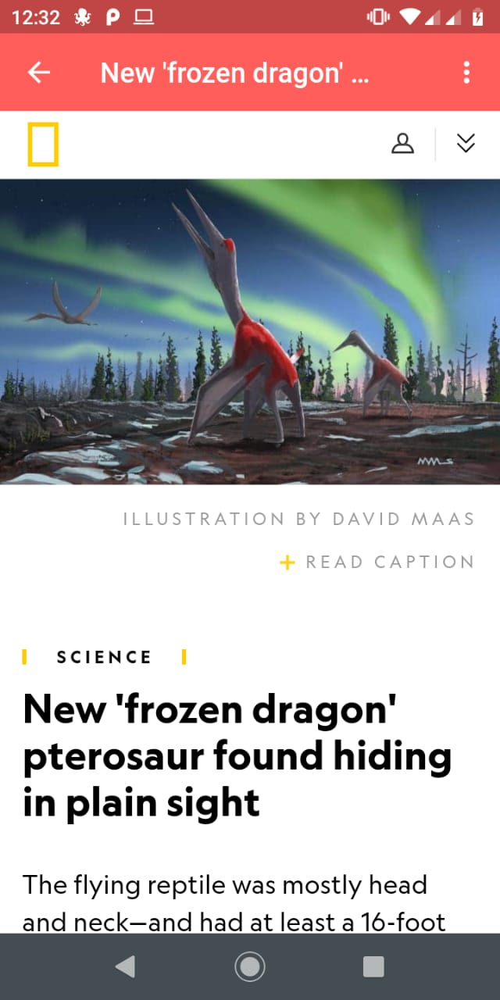

# News App

  

Zero bloatware and ads. Just News.

A news application which will get top headlines from all your favourite sources! API in use can be found at [News API](https://newsapi.org/)


## Getting Started

This is flutter project. If you want to mess around with the code, clone the repo: https://github.com/emem365/news_app.git

### Prerequisites

All you need to get this project running is to set up flutter in your system. To get started with flutter visit [here](https://flutter.dev/docs/get-started/install)
Also. Get an api key from [NewsAPI](https://newsapi.org/) if you want to try it out yourself

### Installing

Clone the project. Make sure you have an emulator running or a device connected to your pc

Run using: 
```
flutter run
```

## Built With

* [Flutter](https://flutter.dev/) - Google’s UI toolkit for building beautiful, natively compiled applications for mobile, web, and desktop from a single codebase.
* [News API](https://newsapi.org/) - API in use


## Authors

* **Madhur Maurya** - *Creator* - [emem365](https://github.com/emem365)


## Acknowledgments

* Again, a huge thanks to https://newsapi.org/ whose free api we use :)
